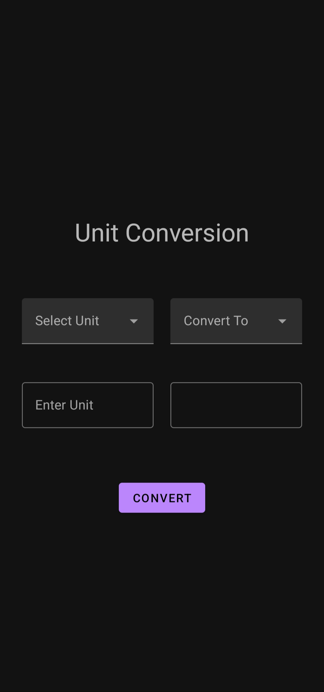

# Convertor

  

  <h3 align="center">Convertor</h3>

  
 
    <a href="https://github.com/Aayushi2307/Convertor"><strong>Explore the docs »</strong></a>
     
     
    <a href="https://github.com/Aayushi2307/Convertor">View Demo</a>
    ·
    <a href="https://github.com/Aayushi2307/Convertor/issues">Report Bug</a>
    ·
    <a href="https://github.com/Aayushi2307/Convertor/issues">Request Feature</a>
  

<!-- ABOUT THE PROJECT -->
## About The Project

I have developed converter using Android. In this application, one can do unit conversions.

Here's why:
* This Application is light and easy to use.
* It is simple to use.....

You may also suggest changes by forking this repo and creating a pull request or opening an issue. Thanks to all the people have contributed to expanding this template!

Use `activity_main.xml` to get started with frontend.

Use `MainActivity.java` to get started with backened.

### Built With

This section will let you know from what this application is built

* [Android](https://developer.android.com/studio) `IDE`
* [Java](https://www.java.com/en/) `Backend Language`
* [XML](https://www.xml.com/) `Frontend Code`
* [Photoshop](https://www.adobe.com/in/products/photoshop.html) `Logo Creation`

